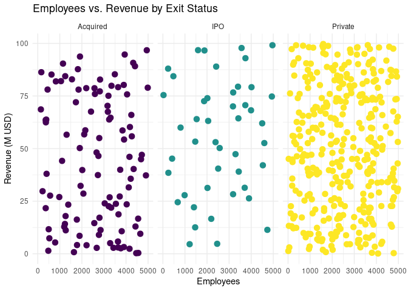
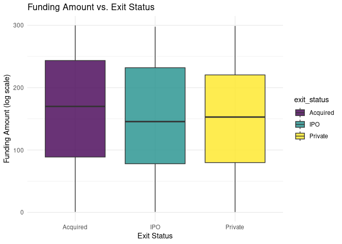
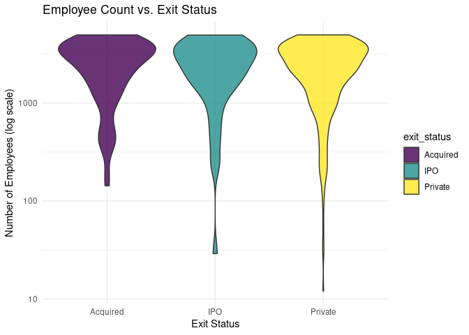
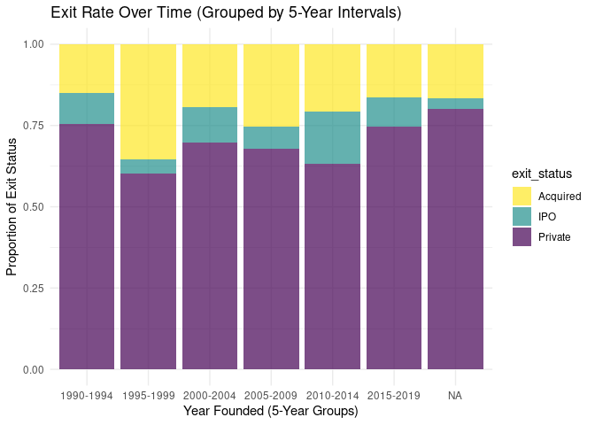
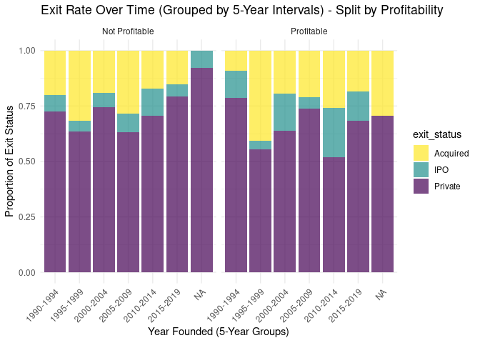
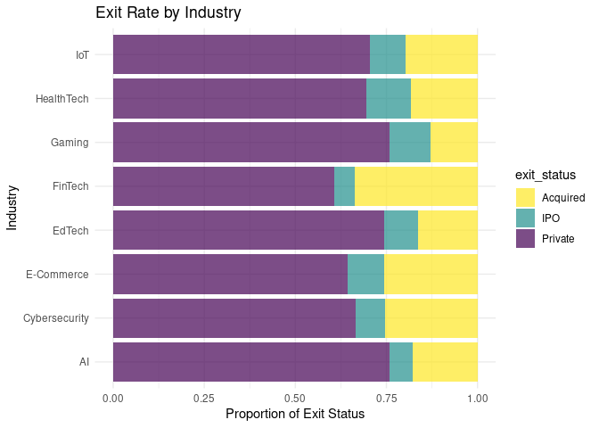
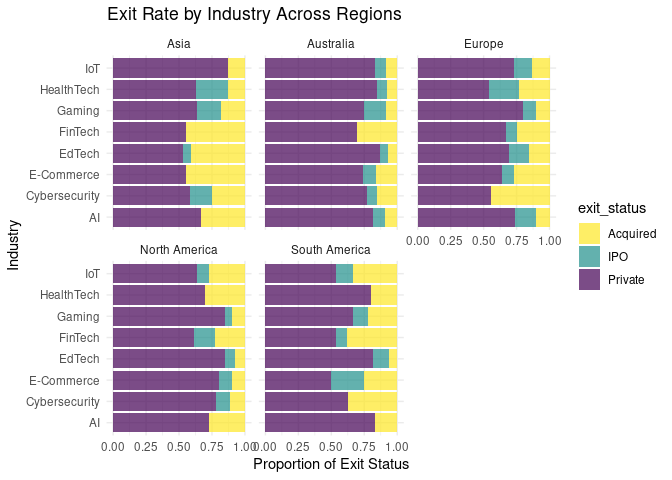
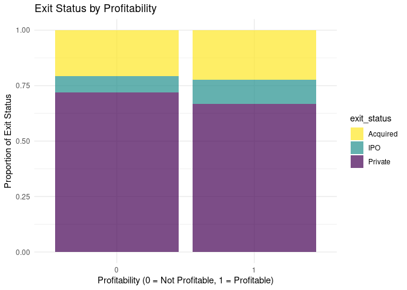
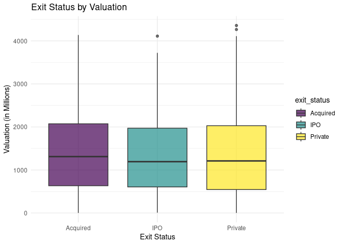
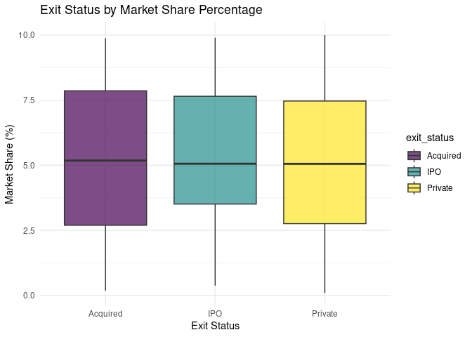

MATH 306: Project Draft 1 Data Work
================
Noah Jarbeau, Phattiya Matrakul, Jelizaveta Tsalaja
2025-03-31

### Graphs in the Proposal

``` r
startups <- read.csv("/cloud/project/startup_data.csv")

colnames(startups) <- c("startup_name", "industry", "funding_rounds", "funding_amount", "valuation", "revenue", "employees", "market_share_percent", "profitable", "year_founded", "region", "exit_status")

colnames(startups)
```

    ##  [1] "startup_name"         "industry"             "funding_rounds"      
    ##  [4] "funding_amount"       "valuation"            "revenue"             
    ##  [7] "employees"            "market_share_percent" "profitable"          
    ## [10] "year_founded"         "region"               "exit_status"

``` r
ggplot(startups, aes(x = funding_amount, y = valuation, color = industry)) +
  geom_point() +
  scale_color_viridis_d() +
  labs(
    title = "Funding Amount vs. Valuation by Industry",
    x = "Funding Amount (M USD)",
    y = "Valuation (M USD)"
  ) +
  theme_minimal() +
  theme(legend.position = "bottom")
```

<!-- -->

This plot shows the relationship between funding and valuation, key
metrics for startup success. By separating the data by industry, we can
see which industries are more likely to attract higher funding and
achieve higher valuations.

``` r
ggplot(startups, aes(x = region, y = market_share_percent, fill = region)) +
  geom_boxplot() +
  scale_fill_viridis_d() +
  labs(
    title = "Market Share Distribution by Region",
    x = "Region",
    y = "Market Share (%)"
  ) +
  theme_minimal() +
  theme(legend.position = "none")
```

<!-- -->

This boxplot visualizes the distribution of market share across
different regions. It helps to compare the spread of market share within
each region and helps us see which regions have the highest and lowest
market share.

``` r
ggplot(startups, aes(x = employees , y = revenue)) +
  geom_point(aes(color = exit_status), size = 3) +
  scale_color_viridis_d() +
  facet_wrap(~exit_status) +
  labs(
    title = "Employees vs. Revenue by Exit Status",
    x = "Employees",
    y = "Revenue (M USD)"
  ) +
  theme_minimal() +
  theme(legend.position = "none")
```

<!-- -->

This faceted scatter plot shows how employee count relates to revenue
within each exit status category. By faceting the data, we can examine
whether startups of different exit statuses tend to have different
relationships between these two variables. This could reveal trends,
such as whether large, high-revenue startups are more likely to be
acquired or go public.

Now, that we have identified out main research question, we will create
data visualisations that are more direclty related to it.

## Which financial and operational factors best predict a startup’s path to a successful exit?

### Funding Amount vs. Exit Status

Goal: To analyze whether higher funding amounts correlate with
successful exits (Acquired, IPO) Visualization: A boxplot of funding
amounts grouped by exit status

``` r
ggplot(startups, aes(x = exit_status, y = funding_amount, fill = exit_status)) +
  geom_boxplot(alpha = 0.8) +
  scale_fill_viridis_d() +
  labs(title = "Funding Amount vs. Exit Status",
       x = "Exit Status",
       y = "Funding Amount (log scale)") +
  theme_minimal()
```

<!-- -->

### Employees vs. Exit Rate

Goal: To examine whether the number of employees is a predictor of a
successful exit Visualization: A violin plot showing the distribution of
employees across exit statuses

``` r
ggplot(startups, aes(x = exit_status, y = employees, fill = exit_status)) +
  scale_fill_viridis_d() +
  geom_violin(alpha = 0.8) +
  scale_y_log10() +  # Log scale to handle large variation
  labs(title = "Employee Count vs. Exit Status",
       x = "Exit Status",
       y = "Number of Employees (log scale)") +
  theme_minimal()
```

<!-- -->

### Year Founded vs. Exit Rate

Goal: To examine whether the year of the foundation is a predictor of a
successful exit

``` r
startups <- startups %>%
  mutate(year_group = cut(year_founded, 
                          breaks = seq(floor(min(year_founded) / 5) * 5, max(year_founded), by = 5), 
                          include.lowest = TRUE, 
                          right = FALSE, 
                          labels = paste(seq(floor(min(year_founded) / 5) * 5, max(year_founded) - 5, by = 5),
                                         seq(floor(min(year_founded) / 5) * 5 + 4, max(year_founded) - 1, by = 5), 
                                         sep = "-")))

ggplot(startups, aes(x = year_group, fill = exit_status)) +
  geom_bar(position = "fill", alpha = 0.7) +
  scale_fill_viridis_d(direction = -1) +
  labs(title = "Exit Rate Over Time (Grouped by 5-Year Intervals)",
       x = "Year Founded (5-Year Groups)",
       y = "Proportion of Exit Status") +
  theme_minimal()
```

<!-- -->

### Exit Status by Profitability over time

``` r
ggplot(startups, aes(x = year_group, fill = exit_status)) +
  geom_bar(position = "fill", alpha = 0.7) +
  scale_fill_viridis_d(direction = -1) +  
  facet_wrap(~ profitable, labeller = labeller(profitable = c("0" = "Not Profitable", "1" = "Profitable"))) +  
  labs(title = "Exit Rate Over Time (Grouped by 5-Year Intervals) - Split by Profitability",
       x = "Year Founded (5-Year Groups)",
       y = "Proportion of Exit Status") +
  theme_minimal() +
  theme(axis.text.x = element_text(angle = 45, hjust = 1))
```

<!-- -->

### Industry vs. Exit Rate

Goal: To see which industries have the highest rates of successful exits
Visualization: A bar plot showing the proportion of startups in each
industry that had a successful exit

``` r
ggplot(startups, aes(x = industry, fill = exit_status)) +
  scale_fill_viridis_d(direction = -1) +
  geom_bar(position = "fill", alpha = 0.7) +  # Stacked bar chart normalized to proportions
  labs(title = "Exit Rate by Industry",
       x = "Industry",
       y = "Proportion of Exit Status") +
  theme_minimal() +
  coord_flip() 
```

<!-- -->

### Industry vs. Exit Rate by Region

Goal: To see which industries have the highest rates of successful exits
and whether they vary based on the region

``` r
ggplot(startups, aes(x = industry, fill = exit_status)) +
  geom_bar(position = "fill") +
  scale_fill_viridis_d(direction = -1, alpha = 0.7) +
  facet_wrap(~ region) +  # Split by region for deeper insight
  labs(title = "Exit Rate by Industry Across Regions",
       x = "Industry",
       y = "Proportion of Exit Status") +
  theme_minimal() +
  coord_flip()
```

<!-- -->

### Exit Status by Profitability

``` r
ggplot(startups, aes(x = factor(profitable), fill = exit_status)) +
  geom_bar(position = "fill", alpha = 0.7) +  
  scale_fill_viridis_d(direction = -1) +  
  labs(title = "Exit Status by Profitability",
       x = "Profitability (0 = Not Profitable, 1 = Profitable)",
       y = "Proportion of Exit Status") +
  theme_minimal()
```

<!-- -->

### Funding Amount vs. Exit Status

``` r
ggplot(startups, aes(x = exit_status, y = funding_amount, fill = exit_status)) +
  geom_boxplot(alpha = 0.7) +
  scale_fill_viridis_d() +
  labs(title = "Exit Status by Funding Amount",
       x = "Exit Status",
       y = "Funding Amount (in Millions)") +
  theme_minimal()
```

<!-- -->

### Valuation vs. Exit Status

``` r
ggplot(startups, aes(x = exit_status, y = valuation, fill = exit_status)) +
  geom_boxplot(alpha = 0.7) +
  scale_fill_viridis_d() +
  labs(title = "Exit Status by Valuation",
       x = "Exit Status",
       y = "Valuation (in Millions)") +
  theme_minimal()
```

<!-- -->

### Market Share % vs. Exit Status

``` r
ggplot(startups, aes(x = exit_status, y = market_share_percent, fill = exit_status)) +
  geom_boxplot(alpha = 0.7) +
  scale_fill_viridis_d() +
  labs(title = "Exit Status by Market Share Percentage",
       x = "Exit Status",
       y = "Market Share (%)") +
  theme_minimal()
```

<!-- -->
