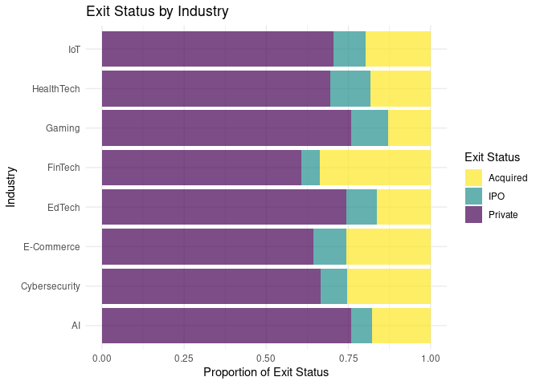
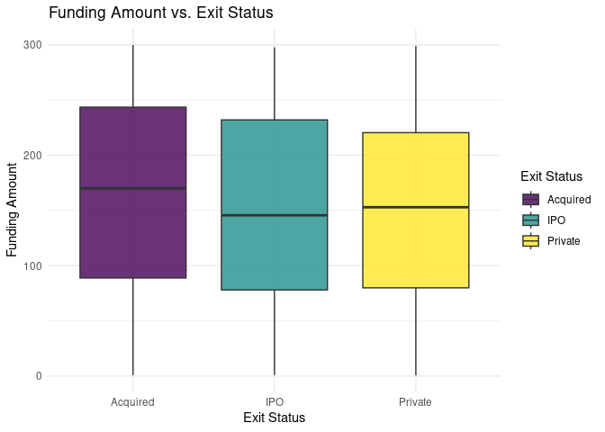
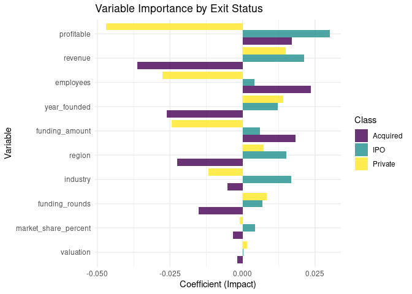

Predicting Startup Exit Outcomes Using Least Squares Classification
================
Noah Jarbeau, Phattiya Matrakul, Jelizaveta Tsalaja
2025-04-07

## Introduction

Startups operate in high-stakes, fast-moving environments where
financial outcomes often hinge on a mix of strategic, operational, and
external factors. In these markets, understanding what influences a
startup’s ability to secure funding and ultimately achieve a successful
exit—whether through acquisition, an IPO, or remaining private—can be
critical for founders and investors. This project explores which
financial and operational factors are most strongly linked to startup
success by applying linear algebra concepts, particularly Least Squares
Classification (LSC), to a real-world dataset. Our main research
question is: which variables best predict whether a startup will get
acquired, go public, or remain private? This question is not only
statistically interesting, but also practically useful in helping
stakeholders allocate resources and make strategic decisions based on
meaningful, data-driven patterns. By understanding these patterns,
founders and investors can focus on the metrics that truly matter.

## Motivation and Background

With access to funding data and financial reports, we can approach
startup performance prediction through quantitative modeling. Our
analysis uses the Startup Growth & Funding dataset \[1\]. It contains a
sample of 500 startups across multiple industries, relating to
financial, operational, and market-related characteristics. We will
analyze 11 variables by mixing numerical and categorical features that
contribute to an understanding of startup performance.

The numerical variables include funding rounds, funding amount (in
millions of USD), valuation (in millions of USD), revenue (in millions
of USD), number of employees, market share percentage, and the year the
startup was founded. Funding rounds tell us how many rounds a company
goes through in seeking funds. In each stage, companies seek funding
capital from investors, which is intended to help grow the company. In
general, a higher number of rounds means there are more investors.
Valuation is a current or projected worth of the company \[2\]. It may
take into consideration market trends and competition. Revenue is the
amount of money the company earns before expenses are deducted. Market
share is “the percent of total sales in an industry generated by a
particular company” \[3\].

Categorical variables include industry (e.g., AI, FinTech, HealthTech),
profitability (binary indicator: profitable or not), exit status (IPO,
acquired, or private), and region (e.g., Europe, South America, North
America). Taken together, these features capture both the financial
underpinnings of a startup (e.g., how much funding it has raised and its
overall valuation) and its operational environment (e.g., market share
and region). By applying LSC to these variables, we can indicate which
factors—like funding rounds or profitability—most strongly predict
whether a startup remains private, launches an IPO, or gets acquired. In
turn, founders and investors can focus their energy on what truly drives
success, making data-informed decisions about fundraising strategy,
growth plans, and long-term sustainability.

To understand the data better before modeling, we visualized some key
relationships. The first visualization was a stacked bar chart showing
exit status broken down by industry.

### Exit Status by Industry

<figure>

<figcaption aria-hidden="true">Figure 1: Exit Status by
Indsutry</figcaption>
</figure>

    ## Saving 7 x 5 in image

The first visualization (Figure 1) shows the Exit Status by Industry as
a stacked bar chart, where each industry is represented by the
proportion of startups that were acquired, went public (IPO), or
remained private. We noticed that industries like FinTech and HealthTech
had a higher percentage of successful exits (either acquisition or IPO),
while fields like Gaming and IoT had more startups that remained
private. This breakdown highlights how industry sector plays a
potentially important role in determining exit outcomes—suggesting that
certain market sectors may offer more favorable conditions for scaling
and investment returns. This observation motivated us to include
“industry” as a key feature in our modeling.

The second visualization was a boxplot of funding amount against exit
status.

### Funding Amount vs Exit Status

<figure>

<figcaption aria-hidden="true">Figure 2: Exit Status by Funding
Amount</figcaption>
</figure>

    ## Saving 7 x 5 in image

The second visualization (Figure 2) displays a boxplot of Funding Amount
vs. Exit Status on a log scale. Surprisingly, the median funding amounts
across the three categories (Acquired, IPO, Private) were quite similar,
with only small differences in spread and range. This was unexpected—we
originally thought funding would be one of the most important predictors
of success. But the visualization showed us that funding alone doesn’t
clearly separate the outcomes, and it might not be as strong a signal as
we assumed. Instead, the plot reinforces the importance of considering
other variables such as region in our classification model, as funding
alone does not clearly separate the categories.

Together, these visualizations gave us important insight into the
patterns within our dataset. They helped us narrow our focus on
variables with stronger predictive signals and confirmed that some
intuitive assumptions (such as higher funding directly leading to IPOs)
don’t always hold when observed through real data.

## Methods Employed

In this project, we applied several linear algebra concepts to prepare
our data and build a model that predicts a startup’s exit status. We
began by loading a dataset containing information about startups and set
a random seed to ensure reproducibility. Then, we cleaned the data by
removing any missing values and renaming the columns for clarity. Since
the startup name was non-numeric and not useful for modeling, we dropped
it. Next, we converted categorical variables such as “exit_status,”
“industry,” and “region” into numeric factors so they could be used in
our model.

After preprocessing, we standardized the numeric features, which
involved transforming each column so that it had a mean of 0 and
standard deviation of 1. This step used ideas from vector norms and
scalar multiplication, and helped make sure all features contributed
equally. Without normalization, variables with larger numeric ranges
could dominate the model. We then combined the scaled features with the
exit status and split the data into training (80%) and testing (20%)
sets. To prepare for modeling, we created dummy variables for the
predictors.

To classify startups into one of three possible outcomes—acquired, IPO,
or private—we used a multi-class least squares classification model.
Specifically, we fit three separate linear models, one for each outcome.
For each startup, we generated predictions from all three models,
organized the results into a matrix, and then assigned each startup to
the class with the highest predicted value. We evaluated the model’s
performance using a confusion matrix, which compared the predicted
classes to the actual exit statuses.

From a linear algebra perspective, the model learns a set of directions
(or weight vectors) in space that best separate the outcomes. Each class
has its own weight vector, and the model calculates a score for each
class by taking the dot product between the startup’s feature vector and
the class’s weight vector. The class with the highest score becomes the
prediction. This process connects closely to our work on vector
projections and orthonormal vectors to understand how one vector points
in the direction of another. In this context, each startup is a point in
high-dimensional space, and the model essentially projects that point
onto the direction of each class to determine which it’s most aligned
with.

## Results

Our research question was: what features can help predict if a startup
will be acquired, go public, or remain private? To answer this, we used
the matrix of startup features we created, and applied a classification
method similar to the multi-class classifier we studied in the class.
The model looks at relationships between the features and the outcome by
treating each startup as a point in high-dimensional space. It then uses
linear projections and weight vectors to predict which class (exit
status) each startup belongs to.

After evaluating the results, we found that region and industry were
more helpful in predicting outcomes than we originally thought. When
these variables were taken away, the accuracy of the model decreased.

The model achieved an overall accuracy of 70.8%, matching the baseline
“no information” rate of 70.8%, which assumes all startups are
classified as the majority class (“Private”). However, this accuracy
comes with significant caveats. The wide 95% confidence interval
(55.9%–83.1%) reflects uncertainty due to the limited test dataset, and
the moderate Kappa score of 0.041 suggests only partial agreement
between predictions and true outcomes. Class-specific performance
further underscored these limitations. The model perfectly identified
“Private” startups (100% sensitivity) but completely failed to detect
“Acquired” startups (0% sensitivity), likely due to the stark class
imbalance: “Private” startups dominated the dataset (70.8% prevalence),
while “Acquired” startups were rare (18.8% prevalence). For IPOs, the
model achieved 0% sensitivity, failing to identify any true cases, but
its high specificity (97.7%) meant IPO predictions were highly reliable
when made. However, the sample size was rather small, and this high
precision may in some ways be attributed to luck.

    ## Confusion Matrix and Statistics
    ## 
    ##           Reference
    ## Prediction  1  2  3
    ##          1  0  0  0
    ##          2  1  0  0
    ##          3  8  5 34
    ## 
    ## Overall Statistics
    ##                                           
    ##                Accuracy : 0.7083          
    ##                  95% CI : (0.5594, 0.8305)
    ##     No Information Rate : 0.7083          
    ##     P-Value [Acc > NIR] : 0.571490        
    ##                                           
    ##                   Kappa : 0.0414          
    ##                                           
    ##  Mcnemar's Test P-Value : 0.002905        
    ## 
    ## Statistics by Class:
    ## 
    ##                      Class: 1 Class: 2 Class: 3
    ## Sensitivity            0.0000  0.00000  1.00000
    ## Specificity            1.0000  0.97674  0.07143
    ## Pos Pred Value            NaN  0.00000  0.72340
    ## Neg Pred Value         0.8125  0.89362  1.00000
    ## Prevalence             0.1875  0.10417  0.70833
    ## Detection Rate         0.0000  0.00000  0.70833
    ## Detection Prevalence   0.0000  0.02083  0.97917
    ## Balanced Accuracy      0.5000  0.48837  0.53571

Variable importance analysis revealed distinct patterns across exit
types. Revenue emerged as a critical but context-dependent predictor.
Higher revenue reduced the likelihood of acquisition (coefficient:
−0.11), suggesting that startups with substantial revenue may prioritize
independence or alternative exit strategies, while lower-revenue
companies might attract acquirers seeking growth potential.

<figure>

<figcaption aria-hidden="true">Figure 3: Varibale Importance by Exit
Status</figcaption>
</figure>

Conversely, revenue positively influenced IPO outcomes (coefficient:
+0.04). This makes sense, because startups that are financially
successful should be more likely to go public. Employees also played a
pivotal role: larger teams strongly predicted a reduced likelihood of
remaining private (coefficient: −0.87), possibly because scaling
workforce size correlates with readiness for exit events. Region and
industry, initially underestimated, proved vital. Their removal degraded
model accuracy, and their coefficients—such as region’s negative impact
on acquisitions (−0.05)—hinted at geographic or sector-specific trends
in exit behavior. For instance, startups in certain regions might face
fewer acquisition opportunities due to market fragmentation or investor
preferences.

## Future Work

This project helped us apply many linear algebra topics we covered in
class, including vector norms, matrix multiplication, and
classification. We learned how to structure real-world data into a
matrix by using linear combinations to make predictions and interpreting
which directions in the data space were most important.

During this project we learned how important the choice of data can be.
We learned how to apply the coding we have learned to new tasks, and how
there are many possibilities when it comes to applying the methods we
have learned. For instance, we could have also switched to use the
backup data we chose, which was on smartwatch data. This shows how once
a model is built, it can be adapted for many different uses.

Possible next steps would include finding a way to deal with data
imbalance, and using regularization techniques to improve the accuracy
of the model. We could also use dimensionality reduction techniques like
eigendecomposition or PCA to understand the most important directions in
the data.

Overall, this project helped us connect mathematical modeling to a
concrete business problem, deepening our understanding of both linear
algebra and the startup ecosystem. While our model was only moderately
successful at predicting outcomes, the process of building it—and seeing
which features mattered most—provided valuable insights into how
data-driven models can challenge assumptions, highlight unexpected
patterns, and inform better decisions in real-world settings.

## References

\[1\] Ashar, Samay. “Startup Growth & Funding Trends.” Kaggle.com, 2025.
<https://doi.org/10853721/aa2f631868a1247c4a97ae6fb7063149>.

\[2\]Hayes, Adam. “Market Share: What It Is and the Formula for
Calculating It.” Investopedia, 23 Aug. 2024,
<https://www.investopedia.com/terms/m/marketshare.asp>.

\[3\] Chen, James. “How the Valuation Process Works.” Investopedia, 30
June 2023, <https://www.investopedia.com/terms/v/valuation.asp>.
