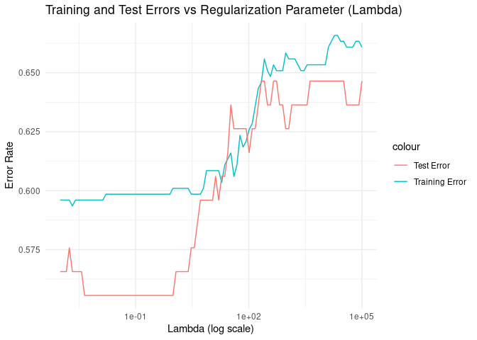

MATH 306: Project Draft 1 Data Work
================
Noah Jarbeau, Phattiya Matrakul, Jelizaveta Tsalaja

## Least Square Classification

``` r
# Load necessary libraries
library(caret)
```

    ## Loading required package: ggplot2

    ## Loading required package: lattice

``` r
library(ggplot2)

# Load dataset
startups <- read.csv("/cloud/project/startup_data.csv")

# Set seed for reproducibility
set.seed(42)

# Remove missing values
startup_data <- na.omit(startups)

# Drop 'Startup.Name' column as it is non-numeric
startup_data <- startup_data[, !names(startup_data) %in% c("Startup.Name")]

# Convert categorical variables into factors
startup_data$Industry <- as.factor(startup_data$Industry)
startup_data$Region <- as.factor(startup_data$Region)
startup_data$Exit.Status <- as.numeric(factor(startup_data$Exit.Status))  # Convert exit status to numeric

# Split data into training (80%) and testing (20%) sets
train_index <- createDataPartition(startup_data$Exit.Status, p = 0.8, list = FALSE)
train_data <- startup_data[train_index, ]
test_data <- startup_data[-train_index, ]

# Convert categorical variables into dummy variables
X_train <- model.matrix(Exit.Status ~ . - 1, data = train_data)  
X_test <- model.matrix(Exit.Status ~ . - 1, data = test_data)

# Convert to matrices
X_train <- as.matrix(X_train)
X_test <- as.matrix(X_test)
y_train <- as.matrix(train_data$Exit.Status)
y_test <- as.matrix(test_data$Exit.Status)

# Ensure no missing values
X_train <- X_train[complete.cases(X_train), ]
y_train <- y_train[complete.cases(y_train), , drop = FALSE]

# Solve for beta using regularization
lambda <- 1e-5  # Small ridge penalty to avoid singular matrix
beta_v <- solve(t(X_train) %*% X_train + lambda * diag(ncol(X_train)), t(X_train) %*% y_train)

# Predictions
y_train_pred <- round(X_train %*% beta_v)
y_test_pred <- round(X_test %*% beta_v)

# Compute classification error
error_rate <- function(y, yhat) {
  mean(y != yhat)
}

train_error <- error_rate(y_train, y_train_pred)
test_error <- error_rate(y_test, y_test_pred)

cat("Training Error:", train_error, "\n")
```

    ## Training Error: 0.5985037

``` r
cat("Test Error:", test_error, "\n")
```

    ## Test Error: 0.5656566

``` r
lambdas <- 10^seq(-3, 5, length.out = 100)  # Range for lambda
train_errors <- c()
test_errors <- c()

for (lambda in lambdas) {
  # Apply regularization
  beta_v <- solve(t(X_train) %*% X_train + lambda * diag(ncol(X_train)), t(X_train) %*% y_train)
  
  # Predictions
  y_train_pred <- round(X_train %*% beta_v)
  y_test_pred <- round(X_test %*% beta_v)
  
  # Store errors
  train_errors <- c(train_errors, error_rate(y_train, y_train_pred))
  test_errors <- c(test_errors, error_rate(y_test, y_test_pred))
}

# Plot errors
df <- data.frame(lambda = lambdas, TrainError = train_errors, TestError = test_errors)

# Visualize with ggplot
ggplot(df, aes(x = lambda)) + 
  geom_line(aes(y = TrainError, color = "Training Error")) +
  geom_line(aes(y = TestError, color = "Test Error")) +
  scale_x_log10() +
  labs(title = "Training and Test Errors vs Regularization Parameter (Lambda)",
       x = "Lambda (log scale)", y = "Error Rate") +
  theme_minimal()
```

<!-- -->

``` r
# Set the optimal lambda value (from the graph)
lambda_optimal <- 1e-01

# Apply regularization with the optimal lambda value
beta_v_optimal <- solve(t(X_train) %*% X_train + lambda_optimal * diag(ncol(X_train)), t(X_train) %*% y_train)

# Predictions
y_train_pred_optimal <- round(X_train %*% beta_v_optimal)  # Round to nearest class
y_test_pred_optimal <- round(X_test %*% beta_v_optimal)

# Compute classification error
train_error_optimal <- error_rate(y_train, y_train_pred_optimal)
test_error_optimal <- error_rate(y_test, y_test_pred_optimal)

cat("Training Error (Optimal Lambda):", train_error_optimal, "\n")
```

    ## Training Error (Optimal Lambda): 0.5985037

``` r
cat("Test Error (Optimal Lambda):", test_error_optimal, "\n")
```

    ## Test Error (Optimal Lambda): 0.5555556

``` r
# Optionally, print the confusion matrix
pred_exit_status_optimal <- factor(y_test_pred_optimal, levels = c(1, 2, 3))
test_data$Exit.Status <- factor(test_data$Exit.Status, levels = c(1, 2, 3))

conf_matrix_optimal <- confusionMatrix(pred_exit_status_optimal, test_data$Exit.Status)
print(conf_matrix_optimal)
```

    ## Confusion Matrix and Statistics
    ## 
    ##           Reference
    ## Prediction  1  2  3
    ##          1  0  0  0
    ##          2 15  5 30
    ##          3  7  3 39
    ## 
    ## Overall Statistics
    ##                                           
    ##                Accuracy : 0.4444          
    ##                  95% CI : (0.3445, 0.5478)
    ##     No Information Rate : 0.697           
    ##     P-Value [Acc > NIR] : 1               
    ##                                           
    ##                   Kappa : 0.0955          
    ##                                           
    ##  Mcnemar's Test P-Value : 1.444e-09       
    ## 
    ## Statistics by Class:
    ## 
    ##                      Class: 1 Class: 2 Class: 3
    ## Sensitivity            0.0000  0.62500   0.5652
    ## Specificity            1.0000  0.50549   0.6667
    ## Pos Pred Value            NaN  0.10000   0.7959
    ## Neg Pred Value         0.7778  0.93878   0.4000
    ## Prevalence             0.2222  0.08081   0.6970
    ## Detection Rate         0.0000  0.05051   0.3939
    ## Detection Prevalence   0.0000  0.50505   0.4949
    ## Balanced Accuracy      0.5000  0.56525   0.6159
