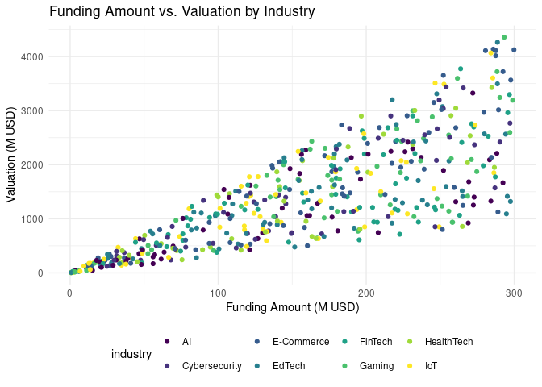
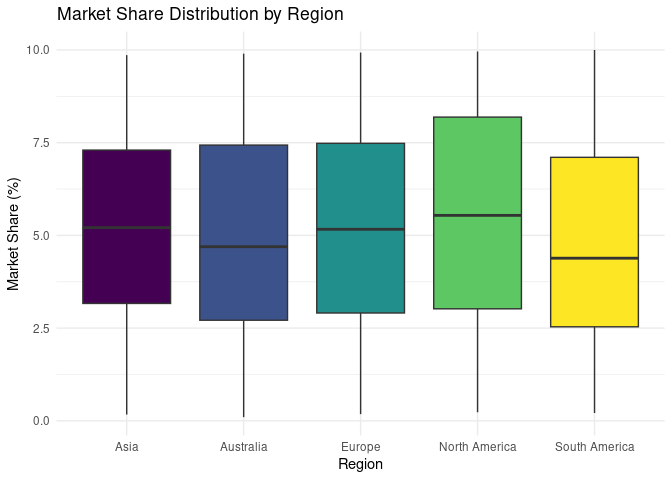
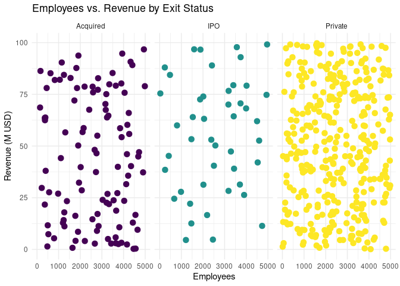

MATH 306: Proposal
================
2025-03-16

## Proposal

### A brief description of the dataset

### Data visualisations

### A brief description of the topic that you are proposing to work with

### A brief description of the application that you are proposing to work with

``` r
library(dplyr)
library(mosaic)
library(ggplot2)
```

## Data

The dataset that we chose contains information on 500 startups, focusing
on various characteristics such as industry, funding, valuation,
revenue, market share, profitability, and geographic region. The
population of interest is startups across different sectors, and the
data includes 12 variables. Among these, numerical variables include
funding rounds, funding amount (in millions of USD), valuation (in
millions of USD), revenue (in millions of USD), number of employees,
market share percentage, and the year the startup was founded. These
variables provide insight into the financial and operational scale of
the startups. Categorical variables include startup name, industry
(e.g., AI, FinTech, HealthTech), profitability (binary indicator:
profitable or not), exit status (IPO, acquired, or private), and region
(e.g., Europe, South America, North America). We hope that this dataset
provides a diverse set of variables, both numerical and categorical,
that could be used for classification tasks aimed at understanding
startup performance and outcomes.

### Preparing dataset

``` r
startups <- read.csv("startup_data.csv")

colnames(startups) <- c("startup_name", "industry", "funding_rounds", "funding_amount", "valuation", "revenue", "employees", "market_share_percent", "profitable", "year_founded", "region", "exit_status")

colnames(startups)
```

    ##  [1] "startup_name"         "industry"             "funding_rounds"      
    ##  [4] "funding_amount"       "valuation"            "revenue"             
    ##  [7] "employees"            "market_share_percent" "profitable"          
    ## [10] "year_founded"         "region"               "exit_status"

## Data Visualisations

#### Funding amount vs. Valuation by Industry

``` r
ggplot(startups, aes(x = funding_amount, y = valuation, color = industry)) +
  geom_point() +
  scale_color_viridis_d() +
  labs(
    title = "Funding Amount vs. Valuation by Industry",
    x = "Funding Amount (M USD)",
    y = "Valuation (M USD)"
  ) +
  theme_minimal() +
  theme(legend.position = "bottom")
```

<!-- -->

This plot shows the relationship between funding and valuation, key
metrics for startup success. By separating the data by industry, we can
see which industries are more likely to attract higher funding and
achieve higher valuations.

#### Market Share Distribution by Region

``` r
ggplot(startups, aes(x = region, y = market_share_percent, fill = region)) +
  geom_boxplot() +
  scale_fill_viridis_d() +
  labs(
    title = "Market Share Distribution by Region",
    x = "Region",
    y = "Market Share (%)"
  ) +
  theme_minimal() +
  theme(legend.position = "none")
```

<!-- -->

This boxplot visualizes the distribution of market share across
different regions. It helps to compare the spread of market share within
each region and helps us see which regions have the highest and lowest
market share.

#### Employees vs. Revenue by Exit Status

``` r
ggplot(startups, aes(x = employees , y = revenue)) +
  geom_point(aes(color = exit_status), size = 3) +
  scale_color_viridis_d() +
  facet_wrap(~exit_status) +
  labs(
    title = "Employees vs. Revenue by Exit Status",
    x = "Employees",
    y = "Revenue (M USD)"
  ) +
  theme_minimal() +
  theme(legend.position = "none")
```

<!-- -->

This faceted scatter plot shows how employee count relates to revenue
within each exit status category. By faceting the data, we can examine
whether startups of different exit statuses tend to have different
relationships between these two variables. This could reveal trends,
such as whether large, high-revenue startups are more likely to be
acquired or go public.

## Appendix 1

Our group’s second choice dataset is
<https://www.kaggle.com/datasets/mohammedarfathr/smartwatch-health-data-uncleaned/data>.
We are hoping to use Least Squares Classification (LSC) to classify
smartwatch users based on various health metrics and behaviors such as
heart rate, blood oxygen level, step count, sleep duration, activity
level, and stress level. Our would be to predict a user’s activity level
(categorized as Sedentary, Active, or Highly Active) based on the
features collected from their smartwatch. The chosen dataset includes
data from smartwatch users. The population of interest in this dataset
is individuals who monitor their health using a smartwatch, focusing on
users’ physiological metrics such as heart rate, blood oxygen level and
step count. Our chosen dataset consists of data collected from 10,000
smartwatch users. There are both numerical and categorical variables in
the dataset. The numerical variables (Heart Rate, Blood Oxygen Level,
Step Count, Sleep Duration, and Stress Level) have different units
(beats per minute, percentage, and hours) and ranges. The Activity Level
variable, which we hope to predict with our classification, categorizes
users into three groups based on their physical activity, while the
Stress Level is an ordinal variable indicating varying degrees of
perceived stress.

``` r
smartwatch <- read.csv("unclean_smartwatch_health_data.csv")
head(smartwatch)
```

    ##   User.ID Heart.Rate..BPM. Blood.Oxygen.Level.... Step.Count
    ## 1    4174         58.93978               98.80965  5450.3906
    ## 2      NA               NA               98.53220   727.6016
    ## 3    1860        247.80305               97.05295  2826.5220
    ## 4    2294         40.00000               96.89421 13797.3380
    ## 5    2130         61.95017               98.58380 15679.0676
    ## 6    2095         96.28594               94.20291 10205.9923
    ##   Sleep.Duration..hours. Activity.Level Stress.Level
    ## 1      7.167235622316564  Highly Active            1
    ## 2      6.538239375570314  Highly_Active            5
    ## 3                  ERROR  Highly Active            5
    ## 4      7.367789630207228          Actve            3
    ## 5                         Highly_Active            6
    ## 6      8.378342673824589  Highly_Active           10

## Appendix 2

Our group considered the following data sets, in addition to our first
and second choices:

- Heart-disease: <https://archive.ics.uci.edu/dataset/45/heart+disease>

- Poisonous Mushroom: <https://archive.ics.uci.edu/dataset/73/mushroom>

- Breast Cancer:
  <https://archive.ics.uci.edu/dataset/15/breast+cancer+wisconsin+original>

- 2023 season MLB Results
  <https://github.com/fivethirtyeight/data/tree/master/mlb-elo>
